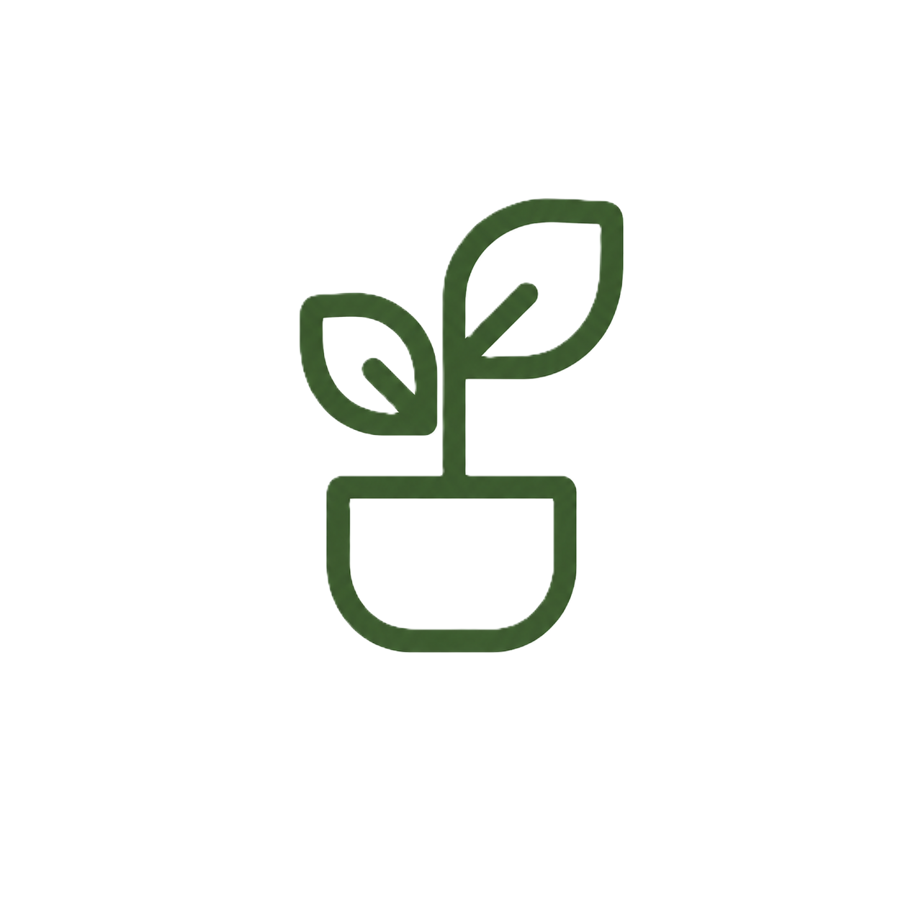
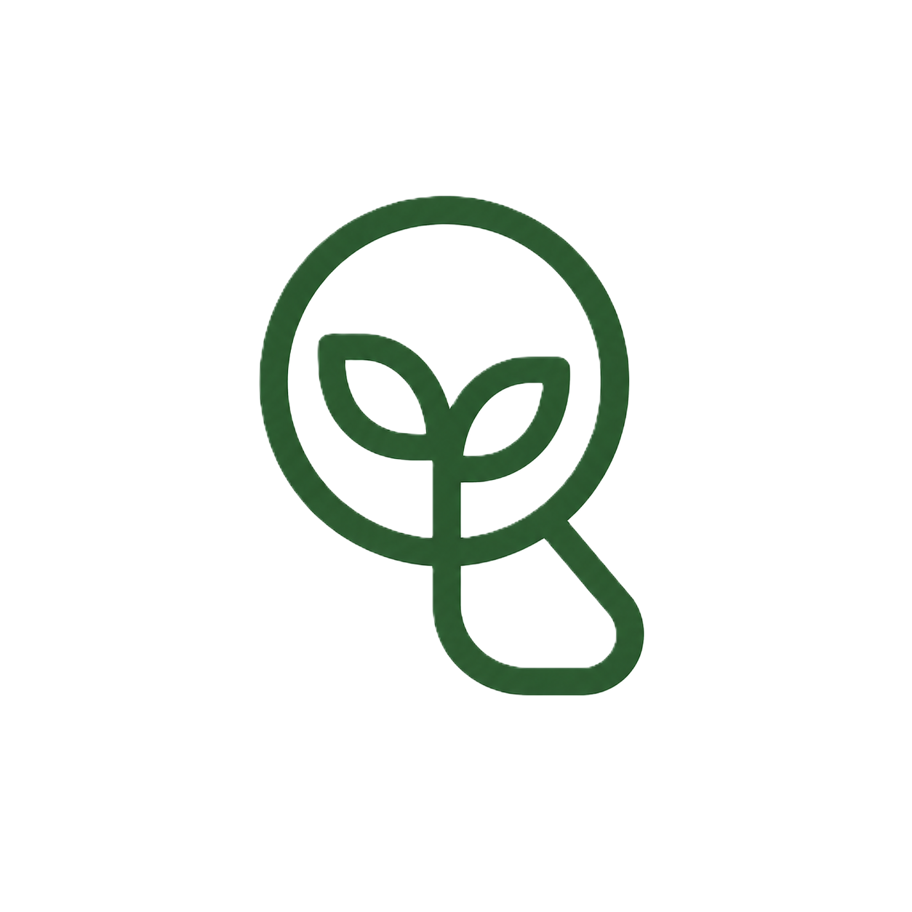
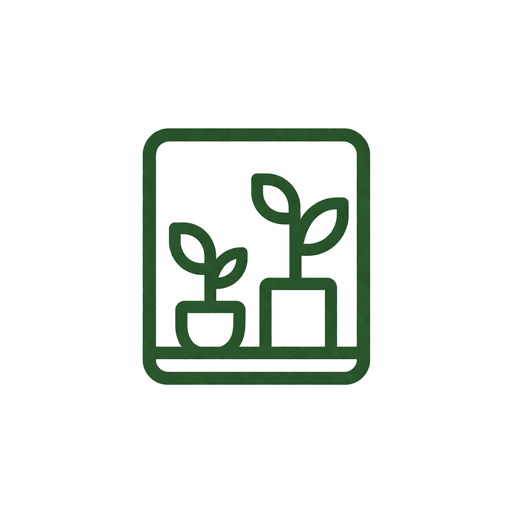
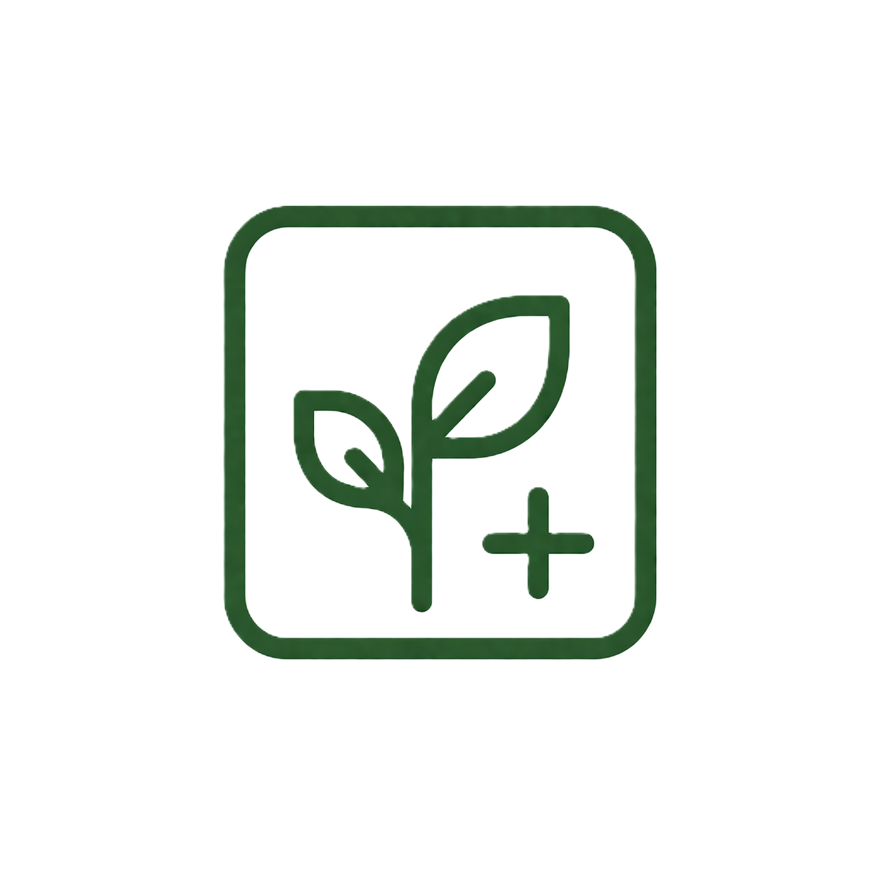
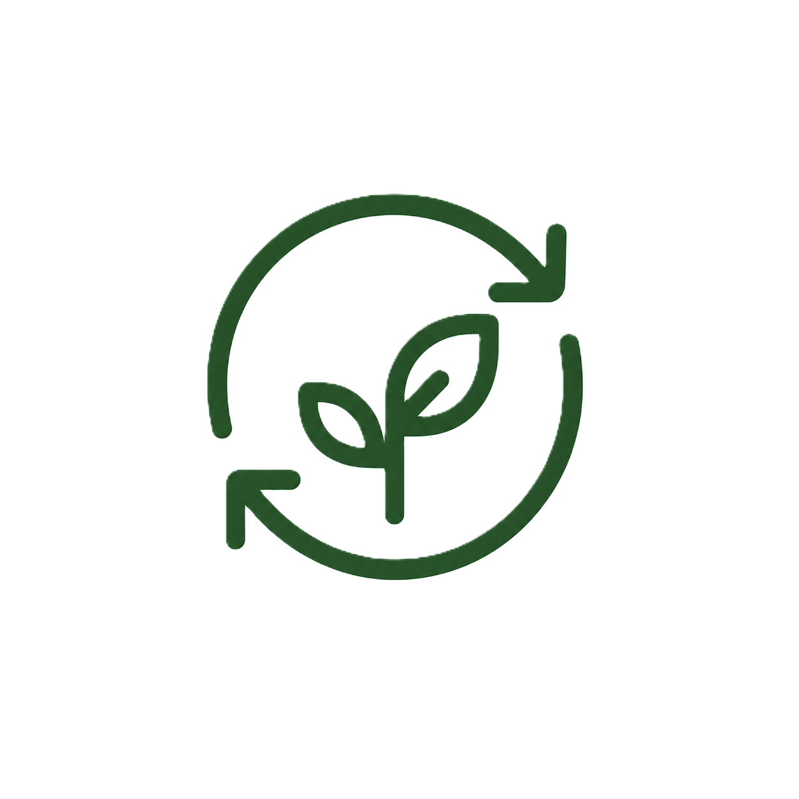
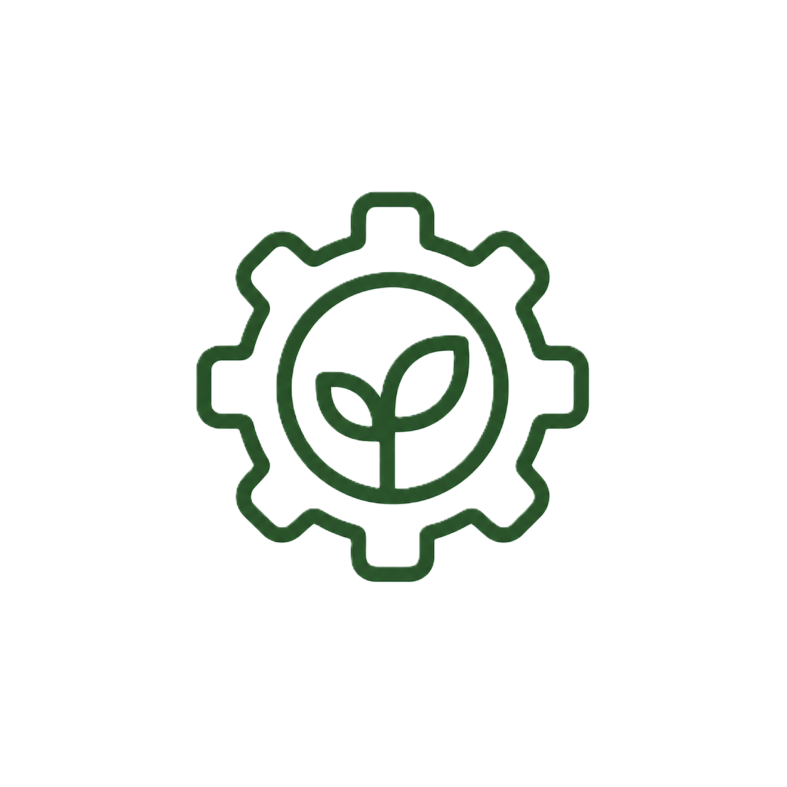
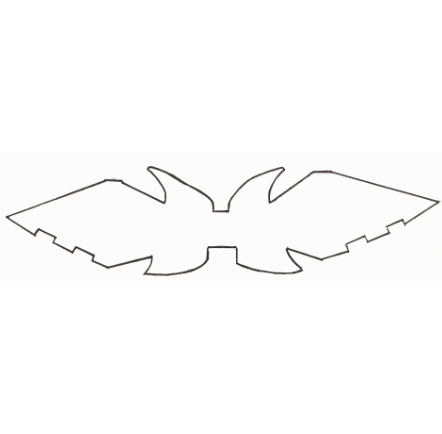

```css
```

```index.html
<!DOCTYPE html>
<html lang="fr">
<head>
    <meta charset="UTF-8">
    <meta name="viewport" content="width=device-width, initial-scale=1.0">
    <title>PinPro - Inspiration Visuelle</title>
    <link rel="stylesheet" href="style.css">
    <link rel="stylesheet" href="variables.css">
<style>
.nav-btn img {
    width: 48px;
    height: 48px;
}
</style>
</head>
<body>
    <main id="app-container" class="layout-wrapper">
        
        <!-- Barre latérale verticale (Sidebar) -->
        <aside class="sidebar">
            <!-- Logo -->
            <figure class="logo-container" role="button" tabindex="0">
                
                <figcaption class="visually-hidden">Pinterest</figcaption>
            </figure>

            <!-- Navigation verticale -->
            <nav class="sidebar-nav">
                <ul>
                    <li>
                        <button class="nav-btn" data-view="home">
                            
                            <span>Accueil</span>
                        </button>
                    </li>
                    <li>
                        <button class="nav-btn" data-view="explore">
                            
                            <span>Explorer</span>
                        </button>
                    </li>
                    <li>
                        <button class="nav-btn" data-view="saved">
                            
                            <span>Enregistré</span>
                        </button>
                    </li>
                    <li>
                        <button class="nav-btn" data-view="create">
                            
                            <span>Créer</span>
                        </button>
                    </li>
                    <li>
                        <button class="nav-btn" data-view="messages">
                            
                            <span>Messages</span>
                        </button>
                    </li>
                    <li>
                        <button class="nav-btn" data-view="updates">
                            
                            <span>Mise à jour</span>
                        </button>
                    </li>
                    <li>
                        <button class="nav-btn" data-view="settings">
                            
                            <span>Paramètres</span>
                        </button>
                    </li>
                </ul>
            </nav>
        </aside>

        <!-- Contenu principal (Header + Grille) -->
        <section class="main-content-area">
            
            <!-- Barre de recherche supérieure -->
            <header class="search-header">
                <section class="search-container">
                    <label for="searchInput" class="visually-hidden">Rechercher</label>
                    <span class="search-icon">🔍︎</span>
                    <input type="text" id="searchInput" class="search-bar" placeholder="Rechercher des idées...">
                </section>

                <nav class="header-icons">
                    <ul>
                        <li>
                            <button class="icon-btn" aria-label="Profil">
                                
                            </button>
                        </li>
                    </ul>
                </nav>
            </header>

            <!-- Zone de grille d'images -->
            <section class="masonry-grid" id="pinGrid">
                <article class="empty-state">
                    <p>Chargement... </p>
                </article>
            </section>

            <!-- Pied de page -->
            <footer class="main-footer">
                <small>&copy; 2026 PinPro - Inspiration Visuelle</small>
                <nav class="footer-nav">
                    <ul>
                        <li><a href="#">Mentions légales</a></li>
                        <li><a href="#">Confidentialité</a></li>
                        <li><a href="#">Contact</a></li>
                    </ul>
                </nav>
            </footer>
        </section>

        <!-- Modale (Popup) -->
        <aside id="pinModal" class="modal" aria-hidden="true" role="dialog">
            <div class="modal-content">
                <button class="modal-close-btn" aria-label="Fermer">&times;</button>
                <div class="modal-image-container">
                    
                </div>
                <div class="modal-info-container">
                    <h2 id="modalTitle"></h2>
                    <div class="modal-author">
                        <span class="author-avatar" id="modalAuthorAvatar"></span>
                        <span id="modalAuthorName"></span>
                    </div>
                    <p id="modalDescription"></p>
                    <button class="save-btn" id="modalSaveBtn">Enregistrer</button>
                </div>
            </div>
        </aside>

        <!-- Toast Notification -->
        <aside id="toast" class="toast" role="status" aria-live="polite" aria-hidden="true">
            <p class="toast-message"></p>
        </aside>
    </main>
</body>
</html>```

```output.md
```

```script.js
/**
 * PinPro - Application d'inspiration visuelle
 * @version 3.0.0
 */

// ========== CONSTANTES ==========
const APP_STORAGE_KEY = 'PINPRO_APP_DATA_V3';

// VOS IMAGES AVEC DESCRIPTIONS UNIQUES - CHEMINS CORRIGÉS
const REAL_IMAGES = [
    {
        src: './css/assets/photos/apres_1.png', // Correct (minuscule)
        title: 'Dypsis lutescens (Palmier Areca)',
        category: 'Plantes Tropicales',
        description: "Offert à ma naissance, c'est à dire moi pour symboliser ma croissance, ce Palmier Areca, emblème de Victoire et de triomphe, partage notre quotidien et s'épanouit au rythme de ma protection.",
        author: 'Arsellia T.'
    },
    {
        src: './css/assets/photos/apres_2.png', // Correct (minuscule)
        title: 'Dracaena fragrans (Dragonnier d\'Afrique)',
        category: 'Plantes Tropicales',
        description: "Symbole de résilience adaptative et d\'équilibre entre ombre et lumière",
        author: 'Arsellia T.'
    },
    {
        src: './css/assets/photos/apres_3.png', // Correct (minuscule)
        title: 'Ficus benjamina \'Variegata\'',
        category: 'Plantes Tropicales',
        description: "Offert à la naissance d'Edene.T, c'est à dire moi pour symboliser ma croissance, ce Variegata, emblème de Le Luxe et le Raffinement, partage notre quotidien et s'épanouit au rythme de ma protection.",
        author: 'Arsellia T.'
    },
    {
        src: './css/assets/photos/Apres_4.png', // Correct (Majuscule)
        title: 'Pachira aquatica (Châtaignier de la Guyane)',
        category: 'Plantes Tropicales',
        description: "Offert à la naissance de Zou pour symboliser sa croissance, ce Pachira, emblème de chance et de richesse, partage notre quotidien et s'épanouit au rythme de sa protection.",
        author: 'Arsellia T.'
    },      
    {
        src: './css/assets/photos/Après_5.png', // Correct (Accent + Majuscule)
        title: 'Yucca elephantipes (Yucca pied d\'éléphant)',
        category: 'Plantes Tropicales',
        description: 'Symbole de force tranquille et de protection, sa structure sculpturale incarne la ténacité et la résilience face aux épreuves.',
        author: 'Arsellia T.'
    },
    {
        src: './css/assets/photos/Apres_6.png', // Correct (Majuscule)
        title: 'Euonymus fortunei \'Emerald \'n\' Gold\'',
        category: 'Plantes d\'Extérieur & Balcon',
        description: 'Symbole de rayonnement et de constance, son feuillage bicolore incarne la lumière persistante à travers les saisons.',
        author: 'Arsellia T.'
    },
    {
        src: './css/assets/photos/Apres_7.png', // Correct (Majuscule)
        title: 'Nerium oleander (Laurier-rose)',
        category: 'Plantes d\'Extérieur & Balcon',
        description: 'Symbole de victoire et de beauté fatale, il incarne la persévérance et la force de caractère sous un soleil ardent.',
        author: 'Arsellia T.'
    },
    {
        src: './css/assets/photos/Apres_8.png', // Correct (Majuscule)
        title: 'Bergenia cordifolia (Plante des savetiers)',
        category: 'Plantes d\'Extérieur & Balcon',
        description: 'Symbole de robustesse et d\'amitié inaltérable, elle incarne la fidélité capable de braver les hivers les plus rudes.',
        author: 'Arsellia T.'
    },
    {
        src: './css/assets/photos/Apres_9.png', // Correct (Majuscule)
        title: 'Lonicera periclymenum (Chèvrefeuille)',
        category: 'Plantes d\'Extérieur & Balcon',
        description: 'Symbole de lient éternels et de dévouement, son parfum et ses lianes entrelacées incarnent l’attachement et la générosité du cœur.',
        author: 'Arsellia T.'
    }
];

// ========== APPLICATION ==========
const pinApp = (function() {
    'use strict';
    
    // État privé
    let allPins = [];
    let savedPinIds = new Set();
    let currentView = 'home';
    let currentFilter = '';
    let searchTimeout = null;
    
    // Éléments DOM
    let pinGrid, searchInput, modal, toast, modalSaveBtn, modalCloseBtn;
    
    // ========== STOCKAGE ==========
    function saveToLocalStorage() {
        try {
            localStorage.setItem(APP_STORAGE_KEY, JSON.stringify(Array.from(savedPinIds)));
        } catch (error) {
            console.error('Erreur localStorage:', error);
            showToast('⚠️ Erreur de sauvegarde', 3000);
        }
    }
    
    function loadFromLocalStorage() {
        try {
            const saved = localStorage.getItem(APP_STORAGE_KEY);
            if (saved) {
                const parsed = JSON.parse(saved);
                if (Array.isArray(parsed)) {
                    savedPinIds = new Set(parsed);
                }
            }
        } catch (error) {
            console.error('Erreur chargement localStorage:', error);
            savedPinIds = new Set();
        }
    }
    
    // ========== GÉNÉRATION DES PINS ==========
    function generatePinsWithRealImages() {
        const pins = [];
        
        REAL_IMAGES.forEach((img, index) => {
            pins.push({
                id: index + 1,
                title: img.title,
                author: img.author,
                imageSrc: img.src,
                category: img.category,
                description: img.description,
                createdAt: new Date(Date.now() - Math.random() * 30 * 24 * 60 * 60 * 1000).toISOString()
            });
        });
        
        return pins;
    }
    
    // ========== RENDU DES PINS ==========
    function getFilteredPins() {
        let result = [...allPins];
        
        if (currentView === 'saved') {
            result = result.filter(pin => savedPinIds.has(pin.id));
        }
        
        if (currentFilter && currentFilter.trim()) {
            const searchTerm = currentFilter.toLowerCase().trim();
            result = result.filter(pin => 
                pin.title.toLowerCase().includes(searchTerm) || 
                pin.category.toLowerCase().includes(searchTerm) ||
                pin.description.toLowerCase().includes(searchTerm)
            );
        }
        
        return result;
    }
    
    function escapeHtml(str) {
        if (!str) return '';
        return str
            .replace(/&/g, '&amp;')
            .replace(/</g, '&lt;')
            .replace(/>/g, '&gt;')
            .replace(/"/g, '&quot;')
            .replace(/'/g, '&#39;');
    }
    
    function createPinCard(pin) {
        const isSaved = savedPinIds.has(pin.id);
        
        const article = document.createElement('article');
        article.className = 'pin-card';
        
        article.innerHTML = `
            <div class="pin-image-container">
                
                <div class="pin-overlay">
                    <button class="save-btn ${isSaved ? 'saved' : ''}" 
                            data-pin-id="${pin.id}" 
                            data-action="save">
                        ${isSaved ? '✓ Enregistré' : 'Enregistrer'}
                    </button>
                </div>
            </div>
            <div class="pin-info">
                <h3 class="pin-title">${escapeHtml(pin.title)}</h3>
                <div class="pin-author">
                    <span class="author-avatar">${escapeHtml(pin.author.charAt(0))}</span>
                    <span class="author-name">${escapeHtml(pin.author)}</span>
                </div>
            </div>
        `;
        
        // Ouverture de la modale au clic sur l'image
        const imageContainer = article.querySelector('.pin-image-container');
        imageContainer.addEventListener('click', (e) => {
            if (!e.target.closest('[data-action="save"]')) {
                openModal(pin);
            }
        });
        
        // Gestionnaire pour le bouton d'enregistrement
        const saveBtn = article.querySelector('[data-action="save"]');
        if (saveBtn) {
            saveBtn.addEventListener('click', (event) => {
                event.stopPropagation();
                toggleSave(pin.id);
            });
        }
        
        return article;
    }
    
    function renderPins() {
        if (!pinGrid) return;
        
        pinGrid.innerHTML = '';
        const displayPins = getFilteredPins();
        
        if (displayPins.length === 0) {
            const emptyDiv = document.createElement('div');
            emptyDiv.className = 'empty-state';
            emptyDiv.innerHTML = `
                <p><strong>${currentView === 'saved' ? '📥 Aucun pin enregistré' : '🔍 Aucun résultat'}</strong></p>
                <p>${currentView === 'saved' ? 'Explorez et enregistrez vos inspirations préférées !' : 'Essayez une autre recherche.'}</p>
            `;
            pinGrid.appendChild(emptyDiv);
            return;
        }
        
        const fragment = document.createDocumentFragment();
        displayPins.forEach(pin => {
            fragment.appendChild(createPinCard(pin));
        });
        pinGrid.appendChild(fragment);
    }
    
    function showToast(message, duration = 2000) {
        if (!toast) return;
        const messageSpan = toast.querySelector('.toast-message');
        if (messageSpan) {
            messageSpan.textContent = message;
        }
        toast.classList.add('show');
        
        setTimeout(() => {
            toast.classList.remove('show');
        }, duration);
    }
    
    function updateSaveButton(pinId, isSaved) {
        // Mise à jour des boutons dans la grille
        const btns = document.querySelectorAll(`.save-btn[data-pin-id="${pinId}"]`);
        btns.forEach(btn => {
            btn.textContent = isSaved ? '✓ Enregistré' : 'Enregistrer';
            btn.classList.toggle('saved', isSaved);
        });
        
        // Mise à jour du bouton dans la modale
        if (modalSaveBtn && modalSaveBtn.dataset.pinId == pinId) {
            modalSaveBtn.textContent = isSaved ? '✓ Enregistré' : 'Enregistrer';
            modalSaveBtn.classList.toggle('saved', isSaved);
        }
    }
    
    function toggleSave(pinId) {
        const isSaved = !savedPinIds.has(pinId);
        
        if (isSaved) {
            savedPinIds.add(pinId);
            showToast('✅ Enregistré dans vos favoris !');
        } else {
            savedPinIds.delete(pinId);
            showToast('❌ Retiré des enregistrements');
        }
        
        saveToLocalStorage();
        updateSaveButton(pinId, isSaved);
        
        // Re-render seulement si on est dans la vue "saved"
        if (currentView === 'saved') {
            renderPins();
        }
    }
    
    function showView(view) {
        currentView = view;
        
        const buttons = document.querySelectorAll('.nav-btn');
        buttons.forEach(btn => {
            btn.classList.remove('active');
            if (btn.getAttribute('data-view') === view) {
                btn.classList.add('active');
            }
        });
        
        if (searchInput) {
            searchInput.value = '';
            currentFilter = '';
        }
        
        renderPins();
    }
    
    function openModal(pin) {
        if (!modal) return;
        
        const isSaved = savedPinIds.has(pin.id);
        
        // Remplir la modale avec les données du pin
        const modalImage = document.getElementById('modalImage');
        const modalTitle = document.getElementById('modalTitle');
        const modalDescription = document.getElementById('modalDescription');
        const modalAuthorName = document.getElementById('modalAuthorName');
        const modalAuthorAvatar = document.getElementById('modalAuthorAvatar');
        
        if (modalImage) modalImage.src = pin.imageSrc;
        if (modalTitle) modalTitle.textContent = pin.title;
        if (modalDescription) modalDescription.textContent = pin.description;
        if (modalAuthorName) modalAuthorName.textContent = pin.author;
        if (modalAuthorAvatar) modalAuthorAvatar.textContent = pin.author.charAt(0);
        
        if (modalSaveBtn) {
            modalSaveBtn.textContent = isSaved ? '✓ Enregistré' : 'Enregistrer';
            modalSaveBtn.classList.toggle('saved', isSaved);
            modalSaveBtn.dataset.pinId = pin.id;
            
            // Remplacer l'ancien écouteur
            const newSaveBtn = modalSaveBtn.cloneNode(true);
            modalSaveBtn.parentNode.replaceChild(newSaveBtn, modalSaveBtn);
            modalSaveBtn = newSaveBtn;
            modalSaveBtn.addEventListener('click', () => toggleSave(pin.id));
        }
        
        modal.classList.add('show');
        document.body.style.overflow = 'hidden';
    }
    
    function closeModal() {
        if (!modal) return;
        modal.classList.remove('show');
        document.body.style.overflow = '';
    }
    
    function init() {
        pinGrid = document.getElementById('pinGrid');
        searchInput = document.getElementById('searchInput');
        modal = document.getElementById('pinModal');
        toast = document.getElementById('toast');
        modalSaveBtn = document.getElementById('modalSaveBtn');
        modalCloseBtn = document.querySelector('.modal-close-btn');
        
        if (!pinGrid) {
            console.error('Élément pinGrid non trouvé');
            return;
        }
        
        // Générer les pins
        allPins = generatePinsWithRealImages();
        loadFromLocalStorage();
        
        console.log(`✅ ${allPins.length} inspirations chargées avec descriptions uniques`);
        
        // Recherche avec debounce
        if (searchInput) {
            searchInput.addEventListener('input', (e) => {
                if (searchTimeout) clearTimeout(searchTimeout);
                searchTimeout = setTimeout(() => {
                    currentFilter = e.target.value;
                    renderPins();
                }, 300);
            });
        }
        
        // Fermeture de la modale
        if (modalCloseBtn) {
            modalCloseBtn.addEventListener('click', closeModal);
        }
        
        if (modal) {
            modal.addEventListener('click', (event) => {
                if (event.target === modal) {
                    closeModal();
                }
            });
            
            document.addEventListener('keydown', (event) => {
                if (event.key === 'Escape' && modal.classList.contains('show')) {
                    closeModal();
                }
            });
        }
        
        // Configurer les boutons de navigation
        document.querySelectorAll('.nav-btn').forEach(btn => {
            const view = btn.getAttribute('data-view');
            if (view) {
                btn.addEventListener('click', () => showView(view));
            }
        });
        
        renderPins();
        console.log('✅ PinPro initialisé - Effet Pinterest actif');
    }
    
    return {
        init,
        showView,
        closeModal,
        toggleSave
    };
})();

window.pinApp = pinApp;```

```style.css
/* ========== RESET & BASE ========== */
* {
    box-sizing: border-box;
    margin: 0;
    padding: 0;
}

body {
    font-family: -apple-system, BlinkMacSystemFont, 'Segoe UI', Roboto, 'Helvetica Neue', Arial, sans-serif;
    background-color: var(--bg-color);
    color: var(--text-color);
    line-height: 1.5;
    overflow-x: hidden;
}

/* ========== ACCESSIBILITÉ ========== */
.visually-hidden {
    position: absolute;
    width: 1px;
    height: 1px;
    padding: 0;
    margin: -1px;
    overflow: hidden;
    clip: rect(0, 0, 0, 0);
    white-space: nowrap;
    border: 0;
}

/* ========== MISE EN PAGE (LAYOUT) ========== */
#app-container.layout-wrapper {
    display: flex;
    min-height: 100vh;
}

/* ========== SIDEBAR (Barre latérale) ========== */
.sidebar {
    width: var(--sidebar-width);
    position: fixed;
    left: 0;
    top: 0;
    height: 100vh;
    background: white;
    border-right: 1px solid var(--gray-light);
    display: flex;
    flex-direction: column;
    align-items: center;
    padding: 20px 0;
    z-index: 1000;
}

.logo-container {
    margin-bottom: 30px;
    cursor: pointer;
    transition: var(--transition);
}

.logo-container img {
    width: 32px;
    height: 32px;
}

.sidebar-nav {
    flex: 1;
    width: 100%;
}

.sidebar-nav ul {
    list-style: none;
    display: flex;
    flex-direction: column;
    align-items: center;
    gap: 20px;
}

.nav-btn {
    background: none;
    border: none;
    cursor: pointer;
    position: relative;
    display: flex;
    justify-content: center;
    align-items: center;
    padding: 12px;
    border-radius: 50%;
    transition: background 0.2s;
}

.nav-btn img {
    width: 38px;
    height: 38px;
    object-fit: contain;
}

.nav-btn span {
    position: absolute;
    left: 100%;
    margin-left: 15px;
    background: var(--text-color);
    color: white;
    padding: 6px 12px;
    border-radius: 8px;
    font-size: 0.8rem;
    white-space: nowrap;
    opacity: 0;
    visibility: hidden;
    transition: opacity 0.2s;
    pointer-events: none;
}

.nav-btn:hover span {
    opacity: 1;
    visibility: visible;
}

.nav-btn:hover {
    background: var(--gray-light);
}

.nav-btn.active {
    background: var(--gray-light);
}

/* ========== ZONE DE CONTENU PRINCIPAL ========== */
.main-content-area {
    margin-left: var(--sidebar-width);
    flex: 1;
    display: flex;
    flex-direction: column;
    min-width: 0;
}

/* Barre de recherche */
.search-header {
    display: flex;
    align-items: center;
    justify-content: space-between;
    gap: 16px;
    padding: 12px 24px;
    position: sticky;
    top: 0;
    background: white;
    z-index: 500;
    border-bottom: 1px solid var(--gray-light);
}

.search-container {
    flex: 1;
    position: relative;
    display: flex;
    align-items: center;
}

.search-bar {
    width: 100%;
    padding: 12px 12px 12px 45px;
    border-radius: 48px;
    border: 1px solid var(--gray-light);
    background: var(--gray-light);
    font-size: 1rem;
    outline: none;
    transition: var(--transition);
}

.search-bar:focus {
    background: white;
    border-color: var(--primary-color);
}

.search-icon {
    position: absolute;
    left: 15px;
    color: var(--gray-medium);
    pointer-events: none;
}

.header-icons ul {
    list-style: none;
    display: flex;
    align-items: center;
    gap: 8px;
}

.icon-btn {
    width: 44px;
    height: 44px;
    border-radius: 50%;
    border: none;
    background: none;
    cursor: pointer;
    display: flex;
    align-items: center;
    justify-content: center;
    font-size: 1.3rem;
    transition: var(--transition);
}

.icon-btn:hover {
    background: var(--gray-light);
}

.btn-icon-img {
    width: 38px;
    height: 38px;
    border-radius: 80%;
    border: 1px solid black;
}

/* ========== GRILLE MASONRY TYPE PINTEREST ========== */
.masonry-grid {
    padding: 20px;
    column-count: 2;
    column-gap: 20px;
}

@media (min-width: 600px) { 
    .masonry-grid { column-count: 3; } 
}
@media (min-width: 900px) { 
    .masonry-grid { column-count: 4; } 
}
@media (min-width: 1200px) { 
    .masonry-grid { column-count: 5; } 
}

.empty-state {
    text-align: center;
    padding: 50px;
    color: var(--gray-medium);
}

/* ========== STYLES DES PINS (EFFET PINTEREST) ========== */
.pin-card {
    break-inside: avoid;
    margin-bottom: 20px;
    border-radius: var(--border-radius);
    overflow: hidden;
    background: white;
    transition: transform 0.2s ease, box-shadow 0.2s ease;
    cursor: pointer;
}

.pin-card:hover {
    transform: translateY(-2px);
}

.pin-image-container {
    position: relative;
    overflow: hidden;
    background: var(--gray-light);
}

.pin-image-container img {
    width: 100%;
    height: auto;
    display: block;
    transition: transform 0.3s cubic-bezier(0.2, 0.9, 0.4, 1.1);
}

.pin-card:hover .pin-image-container img {
    transform: scale(1.03);
}

/* Overlay au survol */
.pin-overlay {
    position: absolute;
    top: 0;
    left: 0;
    right: 0;
    bottom: 0;
    background: rgba(0, 0, 0, 0);
    display: flex;
    align-items: flex-start;
    justify-content: flex-end;
    padding: 12px;
    transition: background 0.2s ease;
    pointer-events: none;
}

.pin-overlay .save-btn {
    pointer-events: auto;
    opacity: 0;
    transform: translateY(-8px);
    transition: all 0.2s cubic-bezier(0.2, 0.9, 0.4, 1.1);
}

.pin-card:hover .pin-overlay {
    background: rgba(0, 0, 0, 0.3);
}

.pin-card:hover .pin-overlay .save-btn {
    opacity: 1;
    transform: translateY(0);
}

/* Informations du pin - CACHÉES PAR DÉFAUT */
.pin-info {
    padding: 0 12px;
    opacity: 0;
    max-height: 0;
    overflow: hidden;
    transition: opacity 0.3s ease, max-height 0.3s ease, padding 0.3s ease;
}

.pin-card:hover .pin-info {
    opacity: 1;
    max-height: 80px;
    padding: 12px;
}

.pin-title {
    font-size: 14px;
    font-weight: 600;
    margin: 0 0 4px 0;
    color: var(--text-color);
    white-space: nowrap;
    overflow: hidden;
    text-overflow: ellipsis;
}

.pin-author {
    display: flex;
    align-items: center;
    gap: 8px;
    font-size: 12px;
    color: var(--gray-medium);
}

.author-avatar {
    width: 24px;
    height: 24px;
    background: var(--primary-color);
    border-radius: 50%;
    display: inline-flex;
    align-items: center;
    justify-content: center;
    color: white;
    font-weight: bold;
    font-size: 11px;
}

.author-name {
    font-size: 12px;
}

/* ========== BOUTON D'ENREGISTREMENT ========== */
.save-btn {
    background: var(--primary-color);
    color: white;
    border: none;
    padding: 8px 16px;
    border-radius: 24px;
    font-weight: 600;
    font-size: 0.85rem;
    cursor: pointer;
    transition: all 0.1s ease;
    box-shadow: 0 2px 8px rgba(0,0,0,0.15);
}

.save-btn:hover {
    transform: scale(1.02);
    background: #c0001f;
}

.save-btn.saved {
    background: #111111;
}

.save-btn:active {
    transform: scale(0.95);
}

/* ========== MODALE ========== */
.modal {
    position: fixed;
    top: 0;
    left: 0;
    width: 100%;
    height: 100%;
    background: rgba(0,0,0,0.85);
    z-index: 2000;
    opacity: 0;
    visibility: hidden;
    transition: opacity 0.3s ease, visibility 0.3s ease;
    display: flex;
    align-items: center;
    justify-content: center;
    padding: 20px;
}

.modal.show {
    opacity: 1;
    visibility: visible;
}

.modal-content {
    background: white;
    width: min(90vw, 1000px);
    max-height: 90vh;
    border-radius: 32px;
    display: flex;
    overflow: hidden;
    position: relative;
}

.modal-close-btn {
    position: absolute;
    top: 16px;
    right: 16px;
    width: 40px;
    height: 40px;
    border-radius: 50%;
    background: rgba(0,0,0,0.5);
    color: white;
    border: none;
    font-size: 24px;
    cursor: pointer;
    z-index: 10;
    display: flex;
    align-items: center;
    justify-content: center;
    transition: background 0.2s;
}

.modal-close-btn:hover {
    background: rgba(0,0,0,0.7);
}

.modal-image-container {
    flex: 1.2;
    background: var(--gray-light);
    display: flex;
    align-items: center;
    justify-content: center;
    padding: 20px;
}

.modal-image-container img {
    width: 100%;
    height: auto;
    max-height: 70vh;
    object-fit: contain;
    border-radius: 16px;
}

.modal-info-container {
    flex: 0.8;
    padding: 32px;
    display: flex;
    flex-direction: column;
    gap: 16px;
}

.modal-info-container h2 {
    font-size: 24px;
    font-weight: 600;
    margin: 0;
}

.modal-author {
    display: flex;
    align-items: center;
    gap: 12px;
    font-size: 14px;
    color: var(--gray-medium);
}

.modal-author .author-avatar {
    width: 32px;
    height: 32px;
    font-size: 14px;
}

.modal-info-container p {
    color: #555;
    line-height: 1.6;
    margin: 0;
}

.modal-info-container .save-btn {
    align-self: flex-start;
    padding: 10px 20px;
    font-size: 1rem;
}

/* ========== FOOTER ========== */
.main-footer {
    padding: 24px;
    text-align: center;
    background: white;
    margin-top: auto;
    border-top: 1px solid var(--gray-light);
}

.footer-nav ul {
    list-style: none;
    display: flex;
    justify-content: center;
    gap: 20px;
    margin-top: 10px;
}

.footer-nav a {
    color: var(--gray-medium);
    text-decoration: none;
    font-size: 0.85rem;
    transition: color 0.2s;
}

.footer-nav a:hover {
    color: var(--primary-color);
}

/* ========== TOAST ========== */
.toast {
    position: fixed;
    bottom: 30px;
    left: 50%;
    transform: translateX(-50%) translateY(100px);
    background: var(--text-color);
    color: white;
    padding: 12px 24px;
    border-radius: 40px;
    opacity: 0;
    visibility: hidden;
    transition: all 0.3s ease;
    z-index: 3000;
    white-space: nowrap;
}

.toast.show {
    opacity: 1;
    visibility: visible;
    transform: translateX(-50%) translateY(0);
}```

```variable.css
/* ========== VARIABLES GLOBALES ========== */
:root {
    --primary-color: #e60023;
    --bg-color: #ffffff;
    --text-color: #111111;
    --gray-light: #efefef;
    --gray-medium: #767676;
    --border-radius: 16px;
    --transition: all 0.3s ease;
    --shadow-hover: 0 8px 16px rgba(0,0,0,0.1);
    --sidebar-width: 80px;
}

/* Version mobile - sidebar plus petite */
@media (max-width: 768px) {
    :root {
        --sidebar-width: 60px;
    }
}```

